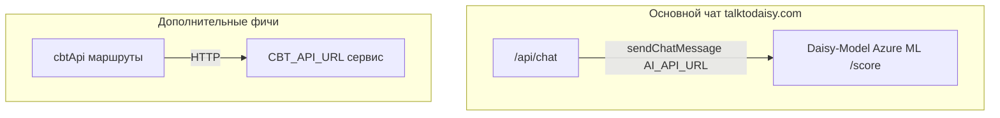

# Мультиагентные фичи и маршрутизация AI (Daisy)

Этот документ фиксирует **продуктовый scope** и **какой код куда ходит** в связке **Daisy-Model** (Azure ML) и веб-приложения **Daisy** (Next.js). Его цель — не дублировать Therapy-Multi-Agent как набор отдельных LLM-агентов, а зафиксировать фактическую архитектуру.

## 1. Scope: single-model vs multi-agent

**Текущее решение (как реализовано в репозиториях):**

- На стороне Azure ML: [inference/score.py](../inference/score.py) — safety (meta / off-topic / crisis), затем **опционально** [двухшаговый router](../inference/router.py) на **той же** загруженной модели (короткий JSON-план: `mode`, `tone`, `focus`, `risk`), затем основной ответ с учётом плана. Отключение: `ENABLE_ROUTER_PASS=false` (меньше латентности). Подробнее — ниже §1.1.
- Сборка system prompt: [system_prompt.py](../inference/system_prompt.py), [personas.py](../inference/personas.py), опционально [translator.py](../inference/translator.py).
- **Оркестрация с БД** выполняется в **приложении** (Next.js API routes, Prisma), а не отдельным LLM «координатором».

### 1.1 Двухшаговый router (разумный компромисс)

Это **не** отдельные веса моделей, а **два последовательных forward-pass** на одном Qwen+LoRA: (1) компактная генерация строгого JSON с ролью «routing module», (2) обычная терапевтическая генерация. План подмешивается в system prompt как скрытые инструкции (пользователь не видит JSON). В `debug_context` ответа поля `router_plan` и `router_enabled` помогают отладке.

Отдельные маленькие/большие модели для каждого агента **не** требуются — при необходимости их можно добавить позже как отдельные endpoint’ы.

**Не реализовано в Daisy-Model:**

- Отдельные LLM-агенты в стиле «только терапия», «только тон», «координатор с памятью БД» как **цепочка независимых вызовов** к разным промптам/моделям (как в полноценном Therapy-Multi-Agent рантайме).
- Контракт HTTP в [API_CONTRACT.md](./API_CONTRACT.md) сознательно **совпадает по форме** с ожиданиями сайта и ссылками на Therapy-Multi-Agent docs — это **API shape**, а не копия мультиагентного движка.

**Если продукту понадобится паритет с полным multi-agent стеком:**

- Потребуется **отдельный эпик**: оркестратор (сервис или явный граф в приложении), несколько вызовов LLM, согласование состояния и стоимости/латентности. Текущий single-model + app orchestration этому не противоречит — это **два разных уровня сложности**.

## 2. Аудит: `sendChatMessage` vs `cbtApi` (Daisy web app)

Код ниже относится к репозиторию **Daisy** (Next.js), пути от корня того репозитория.

### 2.1 Azure ML Daisy (Daisy-Model): `sendChatMessage` → `AI_API_URL` / `AI_API_KEY`

Клиент: `Daisy/src/shared/lib/ai-api.ts` (`sendChatMessage`). Базовый URL из `AI_API_URL` или `NEXT_PUBLIC_AI_API_URL` (ключи `AI_API_KEY` / `NEXT_PUBLIC_AI_API_KEY`).

| Маршрут | Назначение |
|--------|------------|
| `POST /api/chat` | Основной чат продукта; асинхронная обработка, сохранение в БД; вызывает `sendChatMessage` из `Daisy/src/app/api/chat/route.ts` |
| `POST /api/cbt/chat` | Альтернативный UI (`/cbt-chat`); тоже использует `sendChatMessage` из `Daisy/src/app/api/cbt/chat/route.ts` |
| `POST /api/test-ai` | Тест/диагностика `Daisy/src/app/api/test-ai/route.ts` |

**Продакшен talktodaisy.com:** основной пользовательский чат идёт через **`/api/chat`** (см. `Daisy/src/app/[locale]/chat/page.tsx`, `Daisy/src/features/chat/model/chat.service.ts`).

### 2.2 Отдельный CBT / Therapy API: `cbtApi` → `CBT_API_URL` / `CBT_API_KEY`

Клиент: `Daisy/src/shared/lib/cbt-api.ts` (singleton `cbtApi`). Другой хост (по умолчанию в коде — fallback Web App URL; в проде задаётся env).

| Маршрут | Методы cbtApi | Назначение |
|--------|----------------|------------|
| `api/account/*` | `getWeeklyReport`, `getDynamicsInsights` | Недельный отчёт и динамика (часть комментариев в коде указывает на Therapy-Multi-Agent) |
| `api/dashboard/weekly` | `getWeeklyReport` | Дашборд |
| `api/cbt/tone` | `setTone` | Тон |
| `api/cbt/personas` | `getPersonas` | Список персон |
| `api/debug/ai-status` | оба | Отладка |

### 2.3 Сводка

- **Диалог в чате** в основном сценарии — **не** через `cbtApi.chat`, а через **`sendChatMessage`** + **Daisy-Model**.
- **`cbtApi`** остаётся для **отдельных** эндпоинтов (отчёты, динамика, tone/personas, отладка), привязанных к **`CBT_API_URL`**.

## 3. См. также

- [API_CONTRACT.md](./API_CONTRACT.md) — контракт JSON для `/score`.
- Репозиторий Daisy-Model: [README.md](../README.md) — роль LoRA и инференса.
