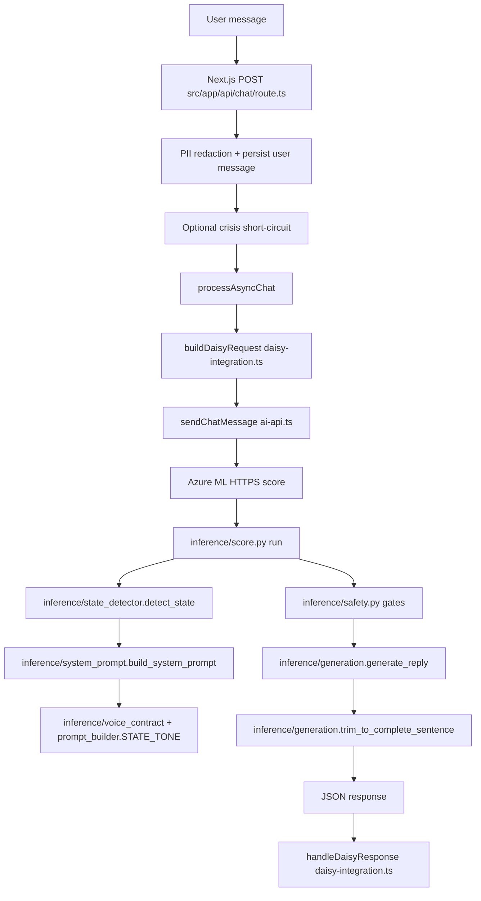

# Daisy AI — Technical Overview

**Audience:** investors and technical due diligence reviewers.  
**Scope:** architecture and engineering claims grounded in the Daisy application code and the Daisy-Model inference repository.

---

## 1. What Daisy Is

Daisy is not a thin proxy around a public chat API. Core therapeutic inference runs on a **self-hosted** stack: the product backend calls an **Azure Machine Learning** managed endpoint that executes the scoring entrypoint (`inference/score.py`). User turns are assembled into a structured JSON payload (history, memory, psychometric context) and sent to that endpoint; there is **no dependency on OpenAI, Anthropic, or Google for the primary reply path**. Optional services (for example Azure OpenAI or Azure Translator) exist only behind feature flags in `inference/translator.py` and are used for auxiliary tasks such as translation when enabled—not as the default therapist model.

The model itself is a **fine-tuned open-weight clinical language model** (7B-class, LoRA-adapted; see `training/train.py` and `azureml/deployment.yaml`). Training data is built from **clinical and psychoeducational source material** distilled into supervised dialogues (see `docs/DATASET.md`, `scripts/prepare_dataset.py`, and `scripts/therapy_training_prompts.py`), not from generic web snapshots. The objective is a responder grounded in evidence-based modalities (CBT, ACT, DBT, and related approaches referenced in training helpers), expressed in a controlled conversational register rather than textbook pastiche—enforced at inference by `inference/system_prompt.py` and `inference/voice_contract.py`.

---

## 2. System Architecture

The web tier lives in the Daisy Next.js app. A chat request hits `src/app/api/chat/route.ts`, which authenticates the user, applies **PII redaction** before persistence (`redactPII` from `@/shared/lib/pii/redactor`), optionally short-circuits **crisis** with a fixed response (`detectCrisis`—no ML call), stores the user message, and kicks off async processing. Async processing calls `buildDaisyRequest` in `src/shared/lib/daisy-integration.ts`, which loads `CbtConversation` / `CbtMessage` history, onboarding data, episodic memory, and the latest `PsychProfileSnapshot`, then sends the payload via `sendChatMessage` in `src/shared/lib/ai-api.ts` to the configured Azure ML **HTTPS** endpoint.

On the model host, `inference/score.py` `run()` loads JSON, sanitizes input (`inference/safety.py` `sanitize_user_input`), may route through an optional **coordinator** plan (`inference/coordinator.py`, `inference/router.py`), classifies **conversation state** (`inference/state_detector.py` `detect_state`), and assembles the **dynamic system prompt** (`inference/system_prompt.py` `build_system_prompt`: voice contract, memory strings, psych profile slice—using `inference/prompt_builder.py` `STATE_TONE` and `inference/voice_contract.py`, merged with router hints via `merge_router_into_system`). Deterministic **safety gates** run before generation (crisis tier, off-topic, meta questions—`inference/safety.py`). The model runs on the **Azure ML** endpoint (`generate_reply`), then **post-generation quality control** applies (`inference/generation.py` `trim_to_complete_sentence`). JSON returns include `debug_context.daisy_state` for logging. The BFF persists the assistant turn with `handleDaisyResponse` in `daisy-integration.ts` (including optional `memory_update` downstream processing).

---

## 3. The Voice Architecture

Daisy treats “voice” as a **state machine over the dialogue**, not a single static system string. `DaisyState` in `inference/state_detector.py` is one of: **intake**, **disclosure**, **psychoeducation**, **action_planning**, or **crisis**. The detector uses pattern cues on the latest user text (and can be augmented by an async LLM classifier in `detect_state_with_llm`; production `score.py` uses the sync detector with crisis already handled upstream by `crisis_tier`).

Each state maps to tone and structural rules in `inference/prompt_builder.py` (`STATE_TONE`) and `inference/voice_contract.py`: banned filler phrases, precision vocabulary, per-phase sentence bounds (`STRUCTURAL_RULES`), few-shot “bad vs good” register examples (`FEW_SHOT_PAIRS` for phases other than intake), and global rules such as **one question per reply**. For mental health this matters because **disclosure** is configured for witnessing without premature reframing, **psychoeducation** for mechanism-first explanations, **action_planning** for bounded actionable steps, and **crisis** for plain-language safety orientation (aligned with resources in `config/crisis_resources.yaml`). Intake stays exploratory before labels or advice accumulate.

---

## 4. Training Pipeline

**Sources.** Source material is grouped into **23** clinical-source folders; synthesis centers on **115** therapeutic insight threads, drawing on psychology textbooks and clinical notes across CBT, DBT, ACT, schema therapy, attachment theory, and crisis protocols. Repository tooling turns prose into dialogue-shaped JSON/JSONL (`scripts/md_to_dialogues.py`, `scripts/md_distill_api.py`, `docs/DATASET.md`) and can layer book-grounded system text (`scripts/therapy_training_prompts.py`).

**Dataset.** The **production** supervised set for the current release comprises **387** training examples synthesized into Daisy-voice dialogues (not verbatim book dumps—`inference/system_prompt.py` explicitly blocks verbatim academic quoting at runtime). The split is approximately **53% Russian / 47% English** by design. The public repo ships **pipeline code and small illustrative samples** (e.g. `data/raw/daisy_curated.json`); the full JSONL is not checked in at scale.

**Method.** Fine-tuning uses **LoRA** (default **QLoRA 4-bit** on a single GPU class) on a **7B** open-weight instruct base (`training/train.py`, `azureml/deployment.yaml` `BASE_MODEL` / `INFERENCE_QUANTIZATION`). `scripts/prepare_dataset.py` expands placeholders with the **same** `build_system_prompt` path used in inference so adapter weights do not fight the production prompt.

**Versioning.** Release **v10** supersedes **v9** after training-data contamination was identified and the dataset was **rebuilt**—documented here as a deliberate QA decision, not an afterthought.

---

## 5. Data Privacy & Sovereignty

- **Hosting:** Inference is deployed via **Azure Machine Learning** (see `azureml/deployment.yaml`); the web app calls that endpoint over **HTTPS**. Target **data residency** is **Azure in regions available to the deployment** (Central Asia / Kazakhstan-aligned placement is a deployment choice rather than a hard-coded constant in the repos cited here).

- **No third-party core inference:** Primary generation does not use external LLM APIs; `docs/API_CONTRACT.md` and `deployment.yaml` describe a self-contained scoring container.

- **PII:** Layer-1 regex redaction runs before DB insert in `route.ts`; `CbtMessage.piiDetected` and `PiiAuditLog` (entity types only, not raw spans) record detections in `prisma/schema.prisma`.

- **Encryption:** Transport uses TLS between clients and the app, and between the app and the ML endpoint. At-rest encryption follows the Azure Database for PostgreSQL / storage configuration bound to `DATABASE_URL` and asset settings (standard cloud defaults—not reimplemented in application code).

- **Auxiliary APIs:** `inference/translator.py` can use **Azure OpenAI** or **Azure Translator** when `USE_OPENAI_TRANSLATION` / `USE_AZURE_TRANSLATOR` are enabled—optional paths for non-core tasks, not the default therapist backbone.

---

## 6. Personalization System

Persisted models include **`CbtConversation`** and **`CbtMessage`** (per-turn `daisyState`, optional persona/protocol), **`PsychProfileSnapshot`** (ESI/BSI/SSI/PVI/MRI and risk flags), and **`MemoryItem`** plus **`ConversationState`** for episodic and rolling session context (`prisma/schema.prisma`). `buildDaisyRequest` merges legacy `User.conversationMemory`, episodic bundles from `getMemoryBundle`, and prefetch data so prompts carry **longitudinal** themes, not only the last message. Incoming profile data can drive **`protocol_directive`** strings (stabilize / regulate / solve) when snapshots exist.

**Historical import**—ingesting exports from other assistants (e.g. ChatGPT or Claude) so Daisy can treat prior dialogue as **provenance** for enduring themes (“you’ve raised this across many months”) rather than as live clinical state—is **in development** and not yet a stable, documented API in the repositories cited here.

---

## 7. Multilingual

**Russian and English** are first-class: training rows carry language metadata, `scripts/validate_batch.py` validates outputs against banned phrase lists in **both** languages, and `score.py` detects language and builds matching system language lines (`inference/system_prompt.py`). **Kazakh** appears in locale handling and crisis copy stubs (`inference/translator.py`, disclaimers in `score.py`); **full Kazakh** therapeutic coverage remains **roadmap**.

---

## 8. What Makes This Hard to Copy

1. **Systems, not weights:** Comparable behavior requires **`detect_state` + `build_system_prompt` + `voice_contract` + `router` merge + `safety` gates + generation settings**—not swapping a base checkpoint.
2. **Dataset:** The distilled 115-insight / multi-folder synthesis pipeline and bilingual dialogue labels are proprietary; public repos here expose mechanics, not the corpus.
3. **Memory moat:** `MemoryItem` / conversation state accrue value with ongoing use—replacing the chat model does not replicate a user’s longitudinal graph.

---

## 9. Current Limitations

- **Capability:** A **7B** adapter does not match frontier reasoning depth; expectations should align with task-focused supportive dialogue.
- **Crisis:** Detection and resources are **supplementary**; they are not a substitute for emergency services or professional care.
- **Coverage gaps:** Tracks such as somatic/polyvagal depth, structured grief work, and ADHD-specific curricula are **not fully represented** in the current training mix (**v3 roadmap**).
- **Kazakh:** UI/locale hooks exist; end-to-end clinical-quality Kazakh is **not yet shipped**.
